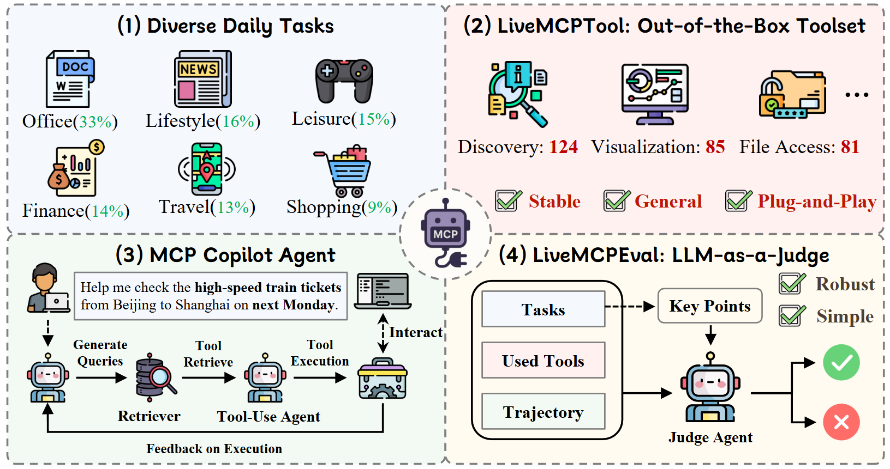

<a id="readme-top"></a>

<!-- PROJECT -->
<br />
<div align="center">
  <h3 align="center">LiveMCPBench: Can Agents Navigate an Ocean of MCP Tools?</h3>

  <p align="center">
    Benchmarking the agent in real-world tasks within a large-scale MCP toolset.
  </p>
</div>
<p align="center">
<a href="https://www.python.org/downloads/release/python-31113/"></a>
<a href="https://github.com/astral-sh/ruff"></a>
</p>

<p align="center">
  🌐 <a href="https://icip-cas.github.io/LiveMCPBench" target="_blank">Website</a> &nbsp; | &nbsp;
  📄 <a href="https://arxiv.org/abs/2508.01780" target="_blank">Paper</a> &nbsp; | &nbsp;
  🤗 <a href="https://huggingface.co/datasets/ICIP/LiveMCPBench" target="_blank">Dataset</a> &nbsp; | &nbsp;
  🏆 <a href="https://docs.google.com/spreadsheets/d/1EXpgXq1VKw5A7l7-N2E9xt3w0eLJ2YPVPT-VrRxKZBw/edit?usp=sharing" target="_blank">Leaderboard</a> 
  &nbsp; | &nbsp;
  🙏 <a href="#citation" target="_blank">Citation</a>
</p>



## News
* [8/3/2025] We release the LiveMCPBench.
## Getting Started

### Prerequisites
We will release our docker image soon, but if you want to run the code locally, you will need to install the following tools:
* npm
* uv
### Installation
1. sync python env

   ```bash
   uv sync
   ```
2. check the MCP tools

   ```bash
   bash ./tools/scripts/tool_check.sh
   ```
   After running this command, you can check ./tools/test/tools.json to see the tools.

3. prepare the .env file

   ```bash
   cp .env_template .env
   ```
   You can modify the .env file to set your own environment variables.
   ```bash
   # MCP Copilot Agent Configuration
    BASE_URL=
    OPENAI_API_KEY=
    MODEL=

    # Tool Retrieval Configuration
    EMBEDDING_MODEL=
    EMBEDDING_BASE_URL=
    EMBEDDING_API_KEY=
    EMBEDDING_DIMENSIONS=1024
    TOP_SERVERS=5
    TOP_TOOLS=3
    # Abstract API Configuration (optional)
    ABSTRACT_MODEL=
    ABSTRACT_API_KEY=
    ABSTRACT_BASE_URL=

    # lark report (optional)
    LARK_WEBHOOK_URL=
   ```

## Quick Start
### MCP Copilot Agent
#### Example Run
You can run the MCP Copilot Agent with the following command:

```bash
bash ./baseline/scripts/run_example.sh
```
This will run the agent with a simple example and save the results in `./baseline/output/`.

#### Full Run
We default use /root dir to store our benchmark data.

1. Move the code repo and create a symbolic link

    You should mv this code repo to `/LiveMCPBench/`, because we will link `/LiveMCPBench/annotated_data` to `/root/`.

    ```bash
    bash scripts/link_path.sh
    ```

    This will create a symbolic link from `/LiveMCPBench/annotated_data/dirs` to `/root/annotated_data`.

2. Run the MCP Copilot Agent

    Be sure you have set the environment variables in the .env file.

    ````bash
    bash ./baseline/scripts/run_baselines.sh
    ````
3. Check the results

    After running the agent, you can check the trajectories  in `./baseline/output`.

### Evaluation using the LiveMCPEval
1. Modify the .env to change evluation models

2. Run the evaluation script

   ```bash
   bash ./evaluator/scripts/run_baseline.sh
   ```

3. Check the results

    After running the evaluation, you can check the results in `./evaluator/output`.

4. Calculate the human agreement

   ```bash
   uv run ./evaluator/human_agreement.py
   ```

   This will calculate the human agreement for the evaluation results and save it in `./evaluator/output/human_agreement.json`.

## Project Structure
```
LiveMCPBench/
├── annotated_data/      # Tasks and task files
├── baseline/            # MCP Copilot Agent
│   ├── scripts/         # Scripts for running the agent
│   ├── output/          # Output for the agent
│   └── mcp_copilot/     # Source code for the agent
├── evaluator/           # LiveMCPEval
│   ├── scripts/         # Scripts for evaluation
│   └── output/          # Output for evaluation
├── tools/               # LiveMCPTool
│   ├── LiveMCPTool/     # Tool data
│   └── scripts/         # Scripts for the tools
├── scripts/             # Path prepare scripts
├── utils/               # Utility functions
└── .env_template        # Template for environment
```
## Citation

If you find this project helpful, please use the following to cite it:
```bibtex
@misc{mo2025livemcpbenchagentsnavigateocean,
      title={LiveMCPBench: Can Agents Navigate an Ocean of MCP Tools?}, 
      author={Guozhao Mo and Wenliang Zhong and Jiawei Chen and Xuanang Chen and Yaojie Lu and Hongyu Lin and Ben He and Xianpei Han and Le Sun},
      year={2025},
      eprint={2508.01780},
      archivePrefix={arXiv},
      primaryClass={cs.AI},
      url={https://arxiv.org/abs/2508.01780}, 
}
```